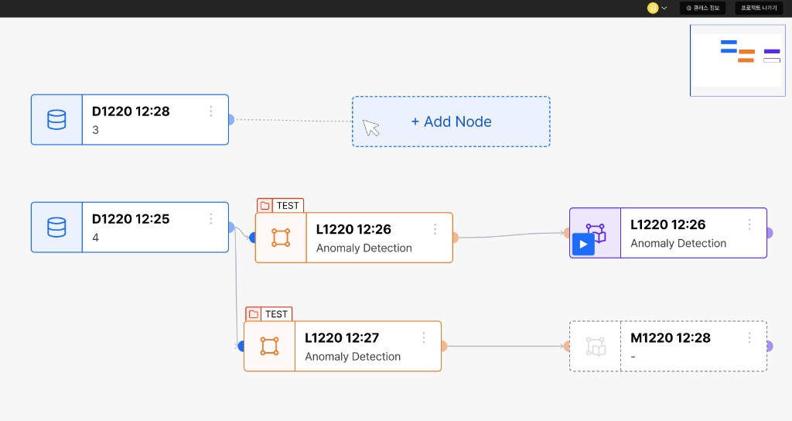
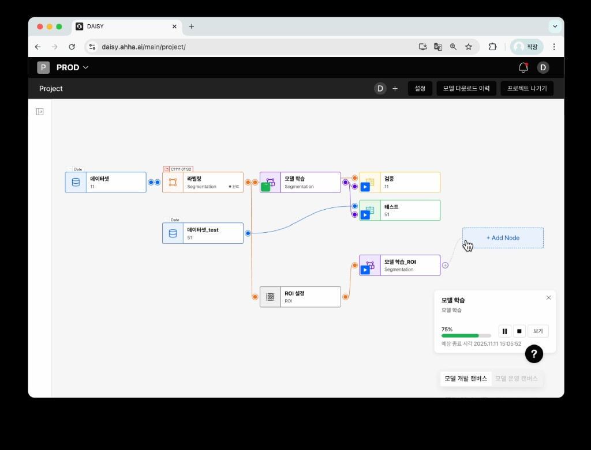
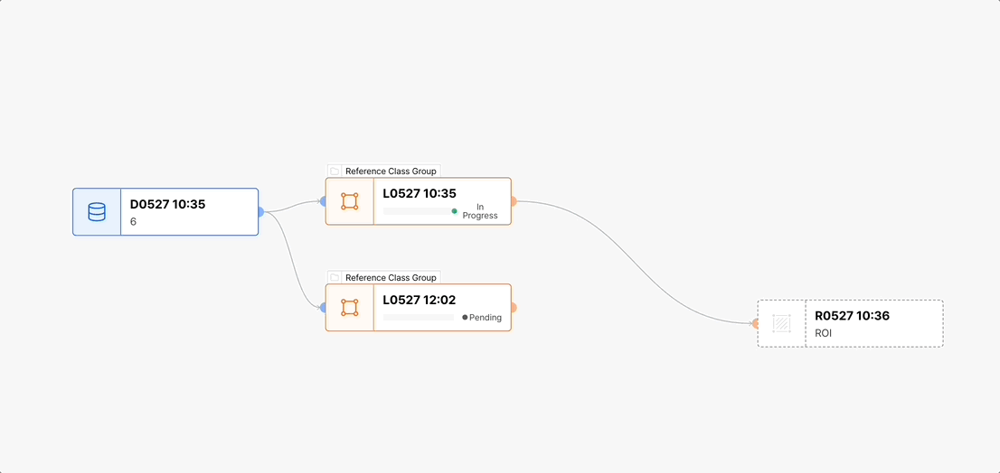
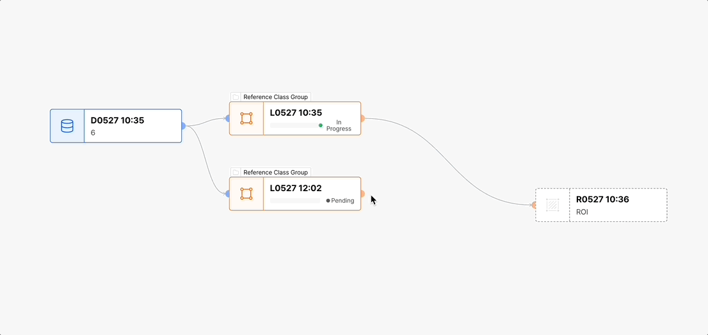

import Mermaid from '../../components/Mermaid.astro';

## Context

[DAISY](https://ahha.ai/daisy/) 프로젝트의 **MLOps 파이프라인 캔버스**에서 데이터셋 → 라벨링 → 학습 → 검증 순으로 노드를 연결해 워크플로를 구성합니다.
기능은 충분했지만, 사용자가 **어디에 연결할 수 있는지**, **지금 무엇을 수정 중인지**를 화면에서 바로 읽기 어려웠습니다.

## Problem

- **새 노드 생성** 시 약 2,000ms 동안 캔버스가 멈춰 작업 흐름이 끊겼습니다.
- **기존 pipeline 노드 수정** 시 100~400ms 구간에서 화면이 잠시 멈췄습니다.
- 입·출력 핸들 색이 단조로워 **어떤 포트끼리 연결되는지** 한눈에 어려웠습니다.
- Placeholder 노드 추가 시 **깜빡임(flickering)** 이 발생했습니다.
- 기능이 나열된 구조라 작업 순서가 화면에서 명확히 드러나지 않았습니다.

## Options

1. 기존 UI 유지 + 문서 보강
2. 화면 배치만 부분 수정
3. **연결 UX·렌더링·단계 피드백**을 함께 재설계 ← 선택

학습 비용을 문서가 아니라 **캔버스와 단계 UI**에서 흡수해야 했고, 인터랙션 지연은 별도로 제거해야 했습니다.

## Solution

### 연결 가능 노드를 색상으로 안내

기획·디자인과 **노드 타입별 색상 규칙**을 맞춰, 입·출력 핸들 색으로 “연결 가능한 포트”를 표시했습니다.
파란 출력 → 파란 입력, 주황 출력 → 주황 입력처럼 **같은 색끼리만 이어지는** 패턴으로, 문서 없이도 연결 규칙을 학습할 수 있게 했습니다.

**Before** — 핸들·엣지 구분이 약해 잘못된 연결을 시도하기 쉬웠습니다.



*Before: 포트 색이 단조로워 연결 가능 여부를 한눈에 파악하기 어려움*

**After** — 노드 타입(데이터셋·라벨링·학습 등)마다 핸들·엣지 색을 맞춰 연결 경로를 시각적으로 고정했습니다.



*After: 타입별 색상 핸들로 연결 가능한 포트를 표시 (DAISY 프로젝트 캔버스)*

### React Flow 렌더링 최적화

`@xyflow/react`는 내부적으로 **Zustand 전역 store**를 사용합니다.
커스텀 Node가 store 상태를 넓게 구독하면, 한 노드를 수정할 때 **연결과 무관한 노드까지** 리렌더되어 캔버스가 100~400ms 멈춘 것처럼 느껴졌습니다.
새 노드·Placeholder 추가 시에는 그 비용이 더 커져 **~2,000ms** 체감 정지로 이어지기도 했습니다.

<Mermaid
  caption="Before: store 변경 시 모든 Node가 리렌더 → After: memo로 변경분만 갱신"
  chart={`
flowchart LR
  subgraph after [After]
    store2["store 변경"]
    store2 --> n1b["Node A만 갱신"]
    n2b["Node B memo"]
    n3c["Node C memo"]
  end
  subgraph before [Before]
    store1["ReactFlow Zustand store"]
    store1 --> n1a["Node A"]
    store1 --> n2a["Node B"]
    store1 --> n3a["Node C"]
  end

`}
/>

**대응**

1. 커스텀 **Node / Edge**를 `React.memo`로 감싸 props 비교 범위를 줄였습니다.
2. store selector는 **해당 노드에 필요한 slice**만 구독하도록 정리했습니다.
3. Placeholder 노드 마운트 시 불필요한 리마운트로 생기던 **flickering** 을 제거했습니다.

```tsx
export const PipelineNode = memo(function PipelineNode(props: NodeProps) {
  // id / data 중심으로 렌더, 전역 store 전체 구독 지양
  return <BaseNode {...props} />;
});

export const PipelineEdge = memo(PipelineEdgeComponent);
```

**Before** — 노드 드래그·핸들 연결·Placeholder 추가 시 끊김이 두드러졌습니다.



*Before: 노드 수정·연결 인터랙션 시 캔버스 멈춤(100~400ms, 생성 시 ~2s)*

**After** — 동일 파이프라인에서 수정·연결이 끊기지 않습니다.



*After: memo·구독 범위 축소 후 인터랙션 지연 체감 제거*


## Results

- **새 노드 생성** 지연을 2,000ms에서 20ms 이하로 개선
- **기존 노드 수정·캔버스 인터랙션** 시 100~400ms 멈춤 해소
- 타입별 색상 핸들로 연결 실수·QA/신규 개발자 온보딩 비용 감소
- 복잡한 기능의 이해 비용을 문서 의존이 아닌 UI 자체에서 흡수

## What I'd do next

- 단계별 이탈 지표를 수집해 막힘 구간을 정량적으로 추적합니다.
- 사용성 테스트를 통해 안내 문구와 피드백 타이밍을 더 정교화합니다.
