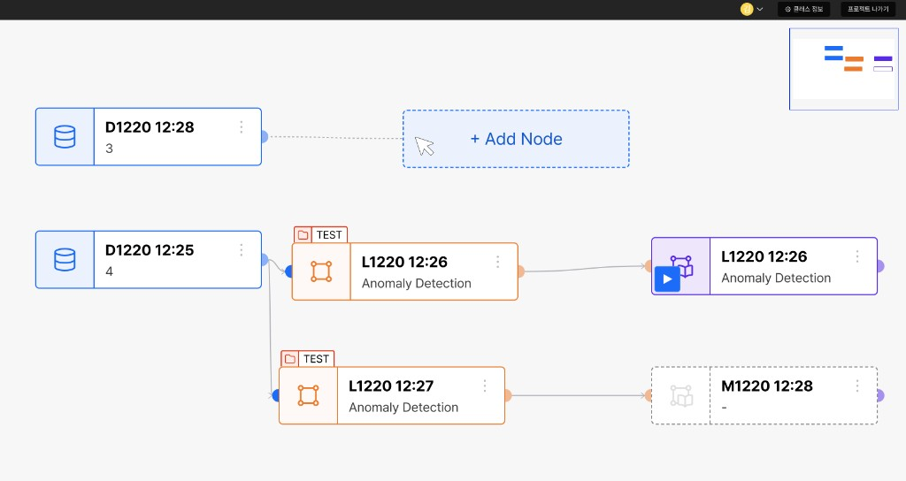
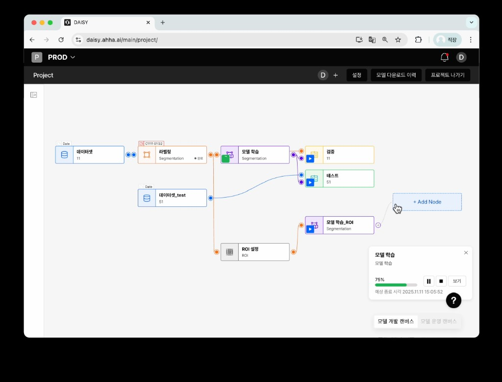
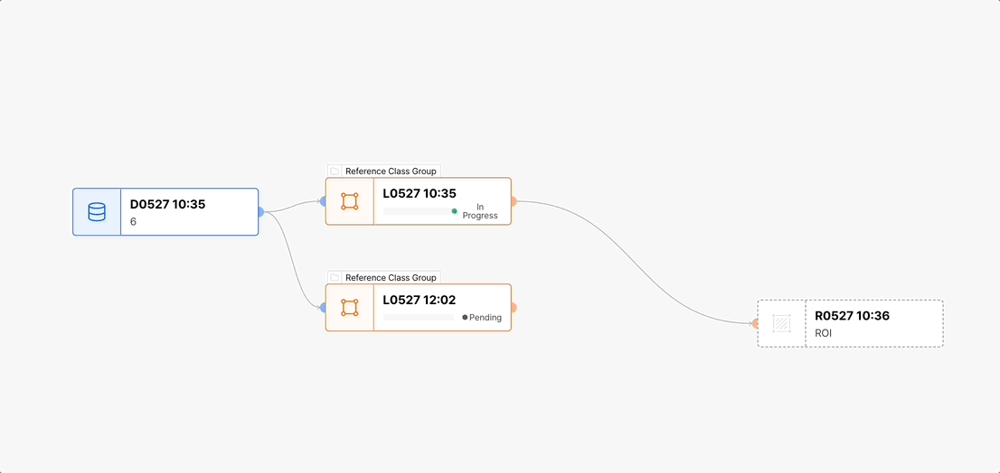
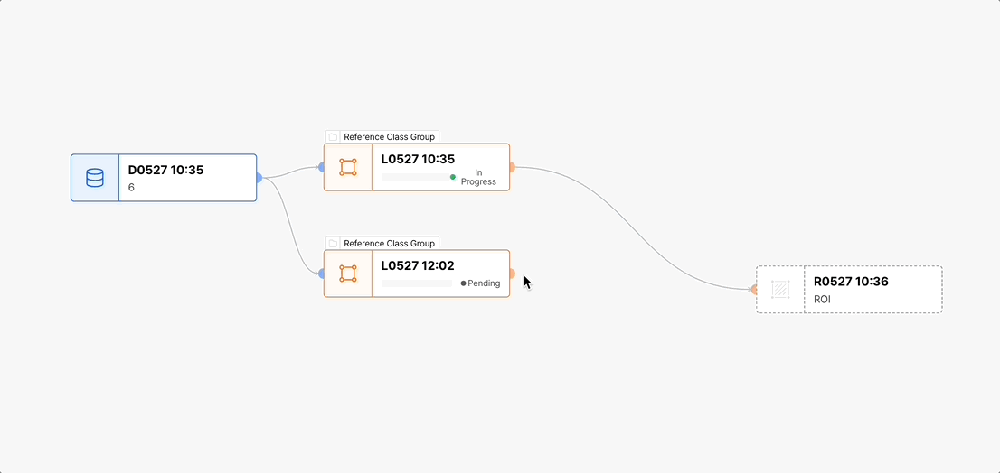

import Mermaid from '../../components/Mermaid.astro';

## 배경

[DAISY](https://ahha.ai/daisy/)의 MLOps 파이프라인 캔버스에서는 데이터셋, 라벨링, 학습, 검증 노드를 연결해 워크플로우를 만듭니다. 연결 규칙이 화면에 드러나지 않았고 노드를 만들거나 수정할 때 캔버스가 멈췄습니다.

## 문제

- 새 노드를 만들면 캔버스가 약 2,000ms 동안 멈췄습니다.
- 기존 파이프라인 노드를 수정할 때도 100~400ms 지연이 생겼습니다.
- 입출력 핸들만 보고는 연결할 수 있는 포트를 구분하기 어려웠습니다.
- Placeholder 노드가 추가될 때 화면이 깜빡였습니다.

## 선택

사용 문서를 추가하는 것만으로는 렌더링 지연을 해결할 수 없었습니다. 연결 규칙은 포트 색상으로 화면에 표시하고, 성능 문제는 React Flow store 구독과 컴포넌트 렌더 범위를 줄여 해결했습니다.

## 구현

### 연결 가능 노드를 색상으로 안내

기획, 디자인과 노드 타입별 색상 규칙을 정하고 입출력 핸들에 적용했습니다. 파란 출력은 파란 입력으로, 주황 출력은 주황 입력으로 연결되도록 같은 타입의 포트를 같은 색으로 표시했습니다.

기존 화면은 핸들과 엣지 구분이 약해 연결 가능 여부를 바로 알기 어려웠습니다.



*Before: 포트 색이 단조로워 연결 가능 여부를 한눈에 파악하기 어려움*

개선한 화면은 데이터셋, 라벨링, 학습 등 노드 타입마다 핸들과 엣지 색을 맞췄습니다.



*After: 타입별 색상 핸들로 연결 가능한 포트를 표시 (DAISY 프로젝트 캔버스)*

### React Flow 렌더링 최적화

`@xyflow/react`는 내부에서 Zustand store를 사용합니다. 커스텀 노드가 넓은 범위를 구독해 노드 하나를 수정해도 관계없는 노드까지 다시 렌더됐습니다. 이때 100~400ms 지연이 생겼고, 새 노드나 Placeholder를 추가하면 약 2,000ms까지 늘었습니다.

<Mermaid
  caption="Before: store 변경 시 모든 Node가 리렌더 → After: memo로 변경분만 갱신"
  chart={`
flowchart LR
  subgraph after [After]
    store2["store 변경"]
    store2 --> n1b["Node A만 갱신"]
    n2b["Node B memo"]
    n3c["Node C memo"]
  end
  subgraph before [Before]
    store1["ReactFlow Zustand store"]
    store1 --> n1a["Node A"]
    store1 --> n2a["Node B"]
    store1 --> n3a["Node C"]
  end

`}
/>

1. 커스텀 Node와 Edge를 `React.memo`로 감싸 props 비교 범위를 줄였습니다.
2. Store selector는 해당 노드에 필요한 slice만 구독하도록 바꿨습니다.
3. Placeholder 노드의 불필요한 remount를 제거했습니다.

```tsx
export const PipelineNode = memo(function PipelineNode(props: NodeProps) {
  // id / data 중심으로 렌더, 전역 store 전체 구독 지양
  return <BaseNode {...props} />;
});

export const PipelineEdge = memo(PipelineEdgeComponent);
```

변경 전에는 노드 drag, 핸들 연결, Placeholder 추가 때마다 끊김이 보였습니다.



*Before: 노드 수정·연결 인터랙션 시 캔버스 멈춤(100~400ms, 생성 시 ~2s)*

변경 후에는 같은 파이프라인에서 노드를 수정하고 연결할 때 발생하던 멈춤이 보이지 않았습니다.



*After: memo·구독 범위 축소 후 인터랙션 지연 체감 제거*


## 결과

- 새 노드 생성 지연을 2,000ms에서 20ms 이하로 줄였습니다.
- 기존 노드를 수정할 때 발생하던 100~400ms 멈춤을 해소했습니다.
- 타입별 핸들 색상으로 연결할 수 있는 포트를 화면에 표시했습니다.

## 다음 단계

- 단계별 이탈 지표를 수집해 사용자가 멈추는 구간을 확인합니다.
- 사용성 테스트로 안내 문구와 피드백 시점을 검증합니다.
